# VIDAL Data Mining

Vidal data mining is a project based on data scrapping and mining using `Python` and [Unitex](https://unitexgramlab.org/). The idea of the project is to extract `drugs (medics)` information from [VIDAL](https://www.vidal.fr) website 
then match each `drug` with its every possible `prescriptions` based on a big `medical corpus` data file `corpus-medical.txt` that contains information about a medical corpus and a history its doctors visits reports.     
> **Notes**: 
> * Vidal website contains information about medications and parapharmacy products.
> * The project is based on FRENCH language

**Vidal website:**

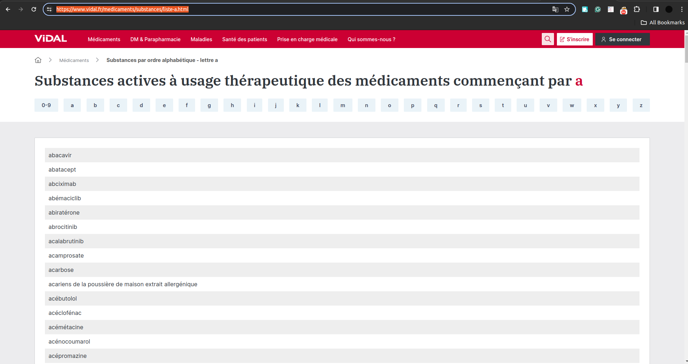

**Content of `corpus-medical.txt`:**

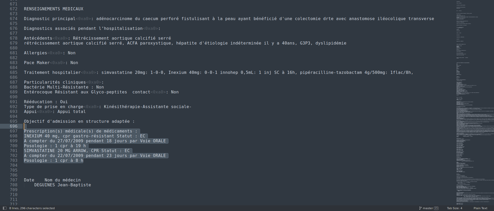

# Usage
## Scrapping **drugs**  from VIDAL and Corpus file Using Python:
- Execute the python script `scrapper.py` to extract drugs substances from [VIDAL](https://www.vidal.fr) Website
  - ```linux 
   	scrapper.py  letter1-letter2
   	```
- `letter1-letter2` argument represent the range of characters. For example `'A-Z'`
- The script generates two files `Subst.dic` and `info.txt`
- `subst.dic` contains all substances extracted with the `Unitex` dictionary suffix added to match the `Unitex` dictionary format `.dic`
   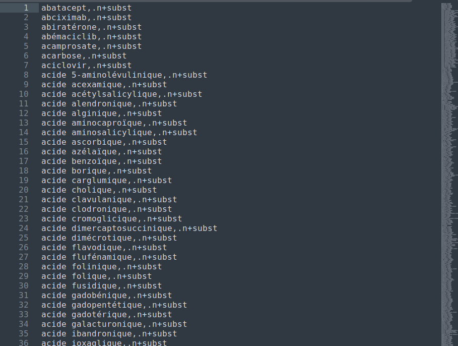
- `info.txt` contains extraction statistics. The number of substance by each letter and the total number of the extracted substances
   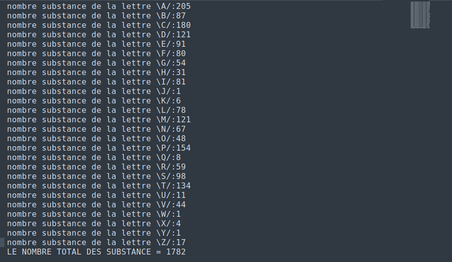
- Execute the python script `enrch.py` to **enrich** our collected substance dictionary. The script scrapes new substances from the file `corpus-medical.txt` and add them into new dictionary `subst_enri.dic`. Also, it will delete duplicated occurrences and sort the substances in both files `subst.dic` & `subst_enri.dic`
  -  ```linux
      enrch.py corpus-medical.txt
     ``` 
  - The output `subst_enri.dic`:
   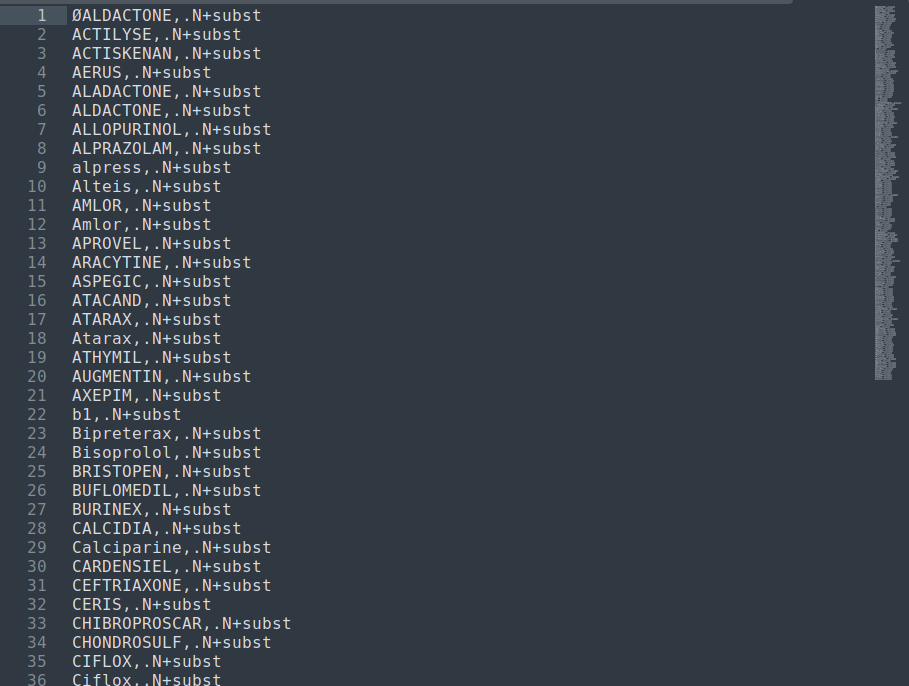


## Matching drugs with their prescriptions using **Unitex**
 - Open `Unitex` and use `FRENCH` as language.
 - Move the files `subset_enri.dic`  `subset.dic` to the path of `Unitex` ***DELA*** folder located in User's documents folder 
	 - Example of my path:
		>D:\Users\Asus\Documents\Unitex-GramLab\Unitex\French\Dela 
 - Apply preprocessing & lexical parsing to `corpus-medical.txt` 
 - Open `subset_enri.dic` in DELA and compress the dictionary into FST. Two files `subst_enri.bin` and `subs_enri.inf` should be generated as in DELA folder
 - Apply the same steps for `subset.dic`
 - Open `projetpy.grf` in FSgraph to visualize extraction graphs schema
   - `projetpy.grf` represents the main graph that consists of 3 graphs (3 possible matchs):
     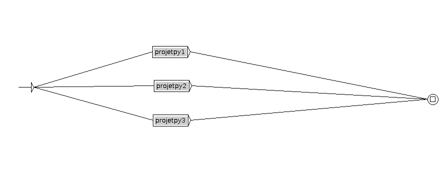
   - `projetpy1.grf`
     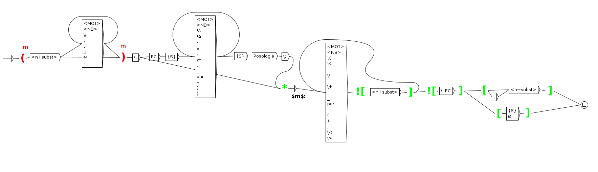
   - `projetpy2.grf`
     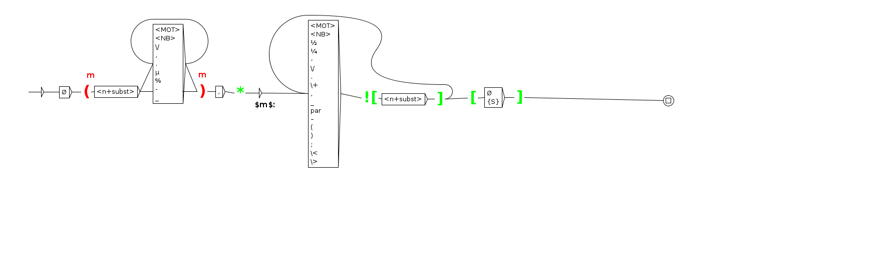
   - `projetpy3.grf`
     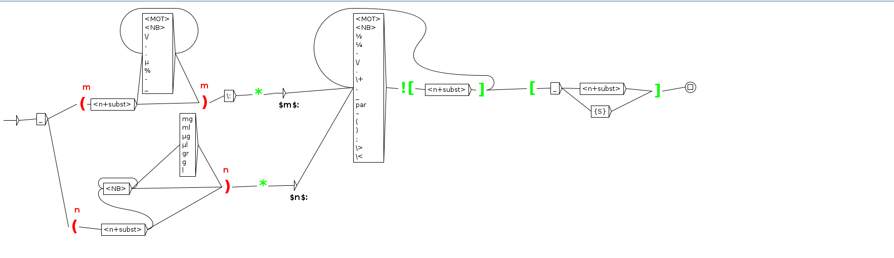
   - ***Notes***: 
     - `<n+subst>` matches a dictionary word. In our case, it is the `drug` name scrapped earlier (`subst_enri.dic` and `subst.dic`) 
     - `<MOT>` matches a word match like `\w` in regular expressions
     - `<NB>` matches a number like `\d` in regular expressions
     - For more information to understand the graph syntax please refer to [Unitex documentation](https://unitexgramlab.org/releases/3.1/man/Unitex-GramLab-3.1-usermanual-en.pdf)
 - Apply lexical ressources to the preprocessed text previously 
 - Select `subst_enri.bin` and `subst.bin` in user ressources and `dela.fr` in system ressources
 - The final step consists of locating patterns and building concordances:
     - Chose locate pattern
     - Select the `projetpy.grf` graph 
     - Select `all_matches` and merge with output text 
     - Index all occurrences in text
     - Build concordance to visualize the results
       > The results are stored in `corpus-medical_snt\concord.html` file located in the same folder of `corpus-medical.txt`
	   
	   > Use a web browser for better formatting
## Results
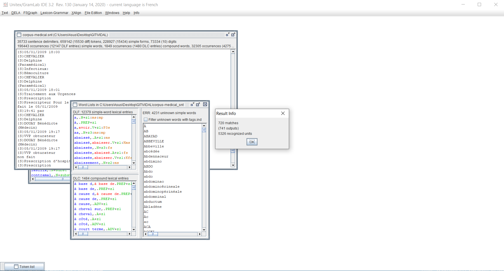
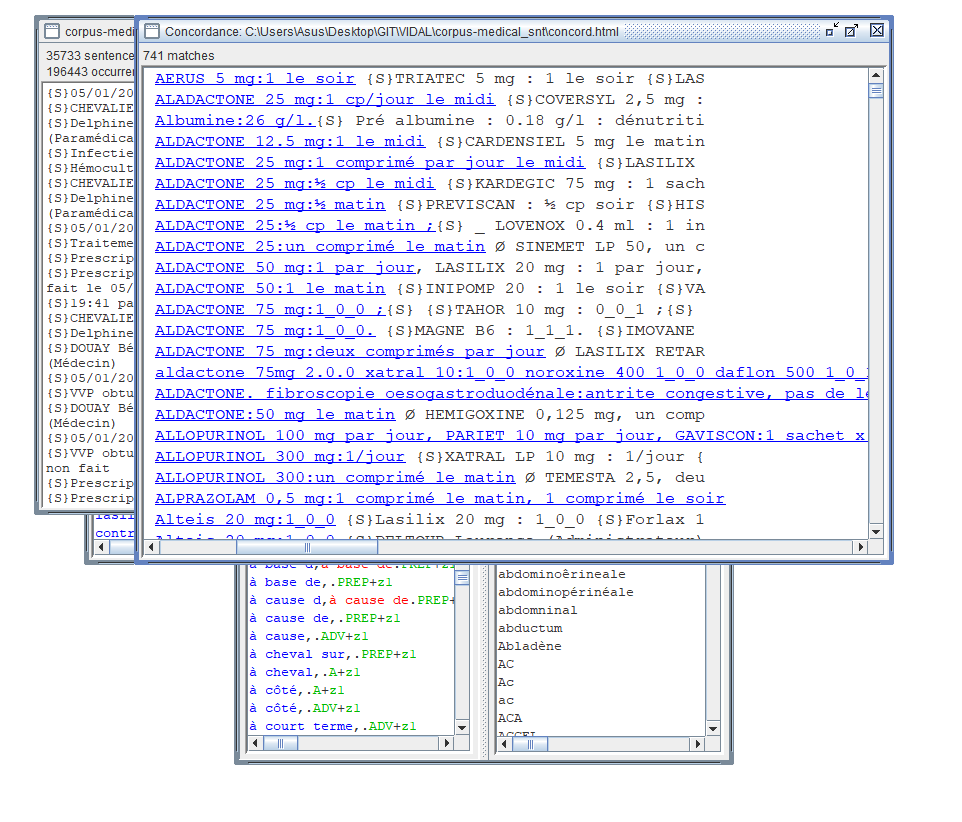
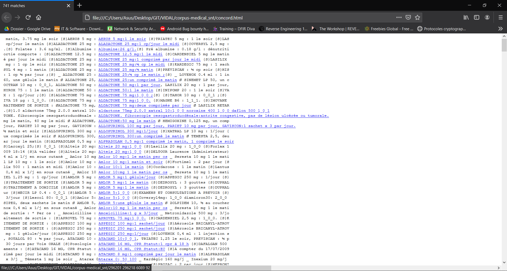
